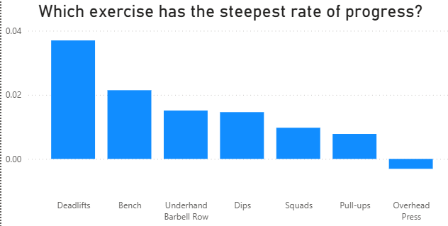
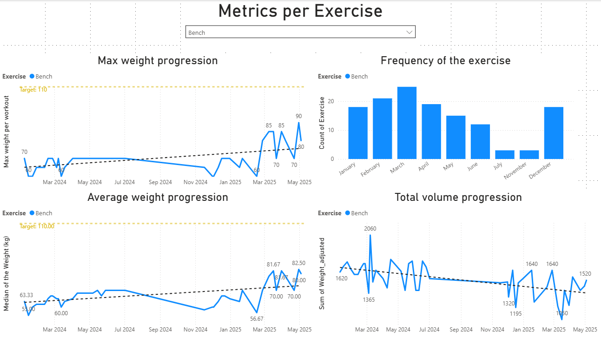
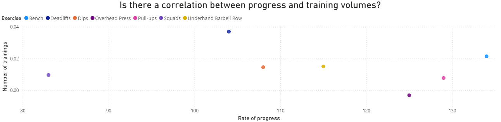

# Gym Progress Tracker & Visualizer

A personal data analytics project transforming raw workout notes into actionable insights using Python, Power BI, and statistical analysis.

## Project Overview

This project addresses a common challenge for fitness enthusiasts: effectively tracking and understanding long-term strength training progress from informal notes. Over the past year and a half, I diligently recorded my gym workouts in simple .txt notepad files on my iPhone. While comprehensive, this raw format made it incredibly difficult to discern overall trends, compare performance across exercises, or identify areas for training optimization.

This project automates the entire process, from parsing unstructured text data to delivering interactive visualizations and data-driven insights in Power BI, enabling a more strategic approach to strength training.

## Problem Statement

Manually reviewing fragmented notepad entries for over 1.5 years of gym data made it nearly impossible to:

* Gain a clear overview of overall strength progression.
* Identify which exercises were progressing well and which were lagging.
* Find any interesting correlations
* Make informed, data-driven decisions to optimize my workout routine and hit new personal records (PRs).

## Data Source & Structure

My raw data consisted of unformatted text notes from my iPhone. Each workout entry typically followed a pattern like this:

DD.MM.YYYY \
Exercise Name WeightKGxReps [WeightKGxReps...] \
Another Exercise WeightKGxReps [WeightKGxReps...] \
...

**Example:**

13.11.2024 \
Pull ups 2.5kgx10 5kgx6x6 \
Dips 15kgx10x10x8 \
Squads 70kgx10 

17.11 \
Bench 50kgx10 60kgx10 65kgx6 \
Underhand bbrow 50kgx12 60kgx10x10 \
Deadlift 100kgx10 

## Methodology & Technologies Used

The project involved a multi-stage data pipeline:

### Data Extraction & Initial Transformation:

* **Python**: Used to write scripts for parsing the raw .txt files.
* **Pandas**: Used for data manipulation, cleaning, and transforming the semi-structured text data into a flat, tabular DataFrame. This involved:
    * Extracting dates, exercise names, weights, and repetitions.
    * Handling varied notations (e.g., 5kgx6x6 implying multiple sets).
    * Standardizing exercise names (e.g., Squads to Squats).
    * Creating a unique **Order of the Set** column to correctly represent each set as a distinct row, flattening the data structure.
    * Handling outliers or wrongly mentioned data points.
* **Output**: A clean, structured `.xlsx` file ready for further analysis.

### Data Modeling & Further Cleaning:

* **Power Query** (within Power BI): Used for additional data cleaning, type conversions, and preparing the data model for visualization and analytic.

### Visualization & Advanced Analytics:

* **Power BI**: The primary tool for creating interactive dashboards and visualizations.
* **DAX (Data Analysis Expressions)**: Used to create custom measures and calculated columns, most notably for:
    * Calculating **Total Volume** (sum of Reps \* Weight) per workout.
    * Deriving the **Linear Regression Slope** for weight progression for each exercise, quantifying the rate of progress over time.

## Key Features & Visualizations
The Power BI dashboard provides a dynamic overview of strength training progress through various interactive visualizations:

* **Individual Exercise Progression**: Slicers allow filtering by specific exercises (Bench, Deadlifts, Squats, Pull-ups, Dips, Overhead Press, Underhand Barbell Row, Leg Raises).
* **Key Progression Metrics**:
    * **Max Weight Progression**: Line chart showing the maximum weight lifted per workout over time.
    * **Average Weight Progression**: Line chart displaying the median weight used per workout over time.
    * **Total Volume Progression**: Line chart illustrating the cumulative load (sum of Reps \* Weight) per workout over time.
    * **Frequency of the Exercise**: Bar chart showing monthly workout counts for the selected exercise.
* **Comparative Progress Rate**: A bar chart visualizing the steepest rate of progress (derived from the linear regression slope of weights) across all exercises.
* **Correlation Analysis**: Visualizations and tables to explore the relationship between:
    * Exercise frequency and weight progression.
    * Average number of reps per exercise and overall weight progress.

### Visualizations: 

* **Overall Rate of Progress by Exercise:** This bar chart clearly visualizes the quantified rate of strength gain for each exercise, derived from linear regression. It helps quickly identify which exercises are progressing fastest and which might need more attention.

* **Detailed Exercise Progression Metrics:** This set of line and bar charts provides a comprehensive view of a selected exercise's performance over time. It includes Max Weight, Average Weight, Total Volume, and monthly Frequency, allowing for in-depth analysis of individual exercise trends.

* **Correlation Insights:** This visualization explores the relationships between various training variables, such as exercise frequency or average reps per set, and their impact on overall weight progression. It helps uncover hidden correlations that can inform training adjustments.

## Key Insights & Personal Impact

The project provided critical, data-driven insights that directly impacted my training strategy:

* **Identified Stagnation**: I discovered a negative trend in my Overhead Press despite it being a frequently performed exercise. This highlighted the need to re-evaluate my approach for this specific lift and to concentrate more on progressive overload.
* **Prioritization**: I should concentrate more on the exercises showing smaller progress (e.g., Overhead Press, Pull-ups, Squats) while maintaining focus on those with strong progression (Deadlifts, Bench, Underhand Barbell Row). This enables more efficient and targeted training.
* **Debunked Assumptions on Frequency**: T The analysis revealed no apparent correlation between training frequency per exercise and weight progression. This showed that without a specific progression plan and deliberately pushing myself into higher reps or weights, I cannot make immense progress.

This project allowed me to make data-driven decisions about my personal fitness, directly addressing the initial frustration of not being able to see overall progress and optimize my training effectively.

## How to View the Project

You can explore the project components here:

* `data/raw/`: Contains example raw .txt notes.
* `data/processed/`: Contains the cleaned and flattened .xlsx file.
* `notebooks/`: Jupyter notebooks demonstrating the Python data extraction, cleaning, and transformation steps.
* `reports/`: Contains screenshots of the Power BI dashboard, and potentially the .pbix file if I choose to upload it (Note: Ensure no sensitive data if sharing .pbix).

To view the interactive Power BI dashboard, you would typically download the `.pbix` file from the `reports/` directory and open it with Power BI Desktop.

